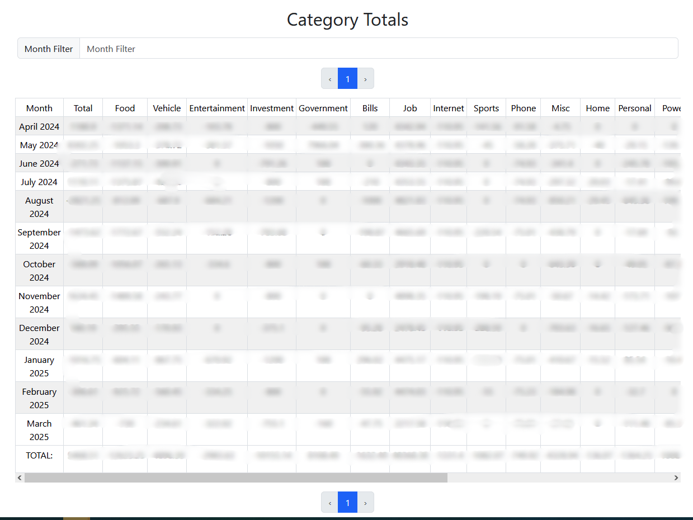

# Personal Finance Tracker

A self-hosted financial application designed to provide you with tailored insights and analytics about your spending patterns.

- Easily Import CSV Bank Statements
- View detailed and actionable metrics
- Self-hostable for offline security

## Visualizations

The web application offers a range of dynamic visualizations to empower you in managing your finances more effectively.
Each visualization can be adjusted using a customizable time range filter, allowing for flexible insights.

#### Overall Summary
The summary shows your total income vs. expenses broken down by category.

#### Account Overview
See all of your transactions as they happened. Easily see if you gained or lost money over a period of time.

#### Monthly Breakdown
Get a monthly breakdown of your spending. See what is costing (or earning) you the most to make some changes!

Graph too hard to read or get data from? Also view your monthly spending per cateogry in a tabular format.

#### Spending Insights
See where you spend your most money and which accounts are most active.

See which vendors you spend the most money at so you know where your money is going and how you can start saving.

## Transaction Searching
Search (and bulk update) any of your transactions with ease.

## Custom Transaction Categories
Map vendors to a category so that future transactions from the same vendor get put in the same category.

Does one vendor have multiple names or formats? No problem. Add a [RegEx pattern](https://regexr.com/) to ensure any variants of the vendor's name match their vendor.

# Running the App

This application uses a backend kotlin server and a vue frontend.
Currently, I only use this project for personal use and just run a dev server whenever I want to update the database or view my finances.

To run the server locally, simply open the project and:

- Run `PersonalFinanceMain.kt` to start the backend web server
- `cd vue/finance-vue`
- `npm install`
- `npm run dev`
- This will start the frontend UI on a localhost server for personal use.

I currently have no need to run this app anywhere other than my PC.
But creating a dockerfile for use in other environments would be trivial.

This application uses a local SQLite database to store transactions and application data.
The database path can be configured in the `finance-server-config.yaml`.
If the file does not exist, it will be created.